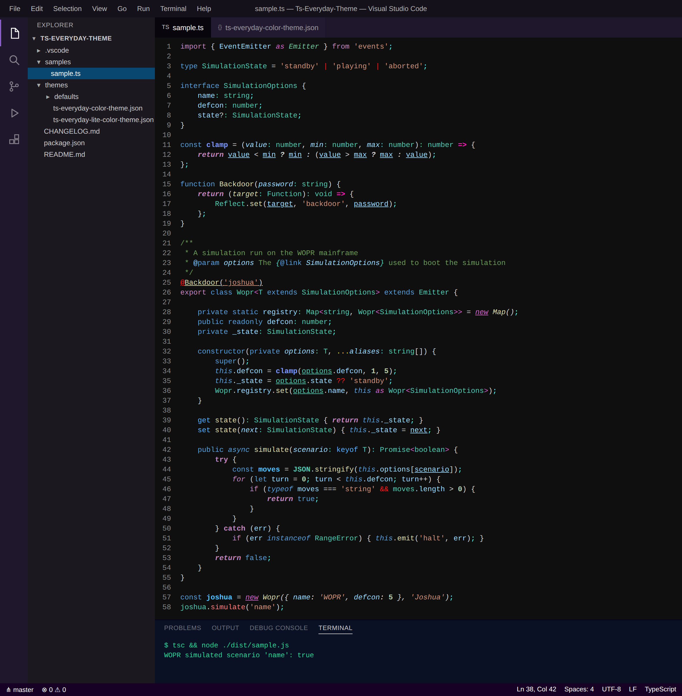
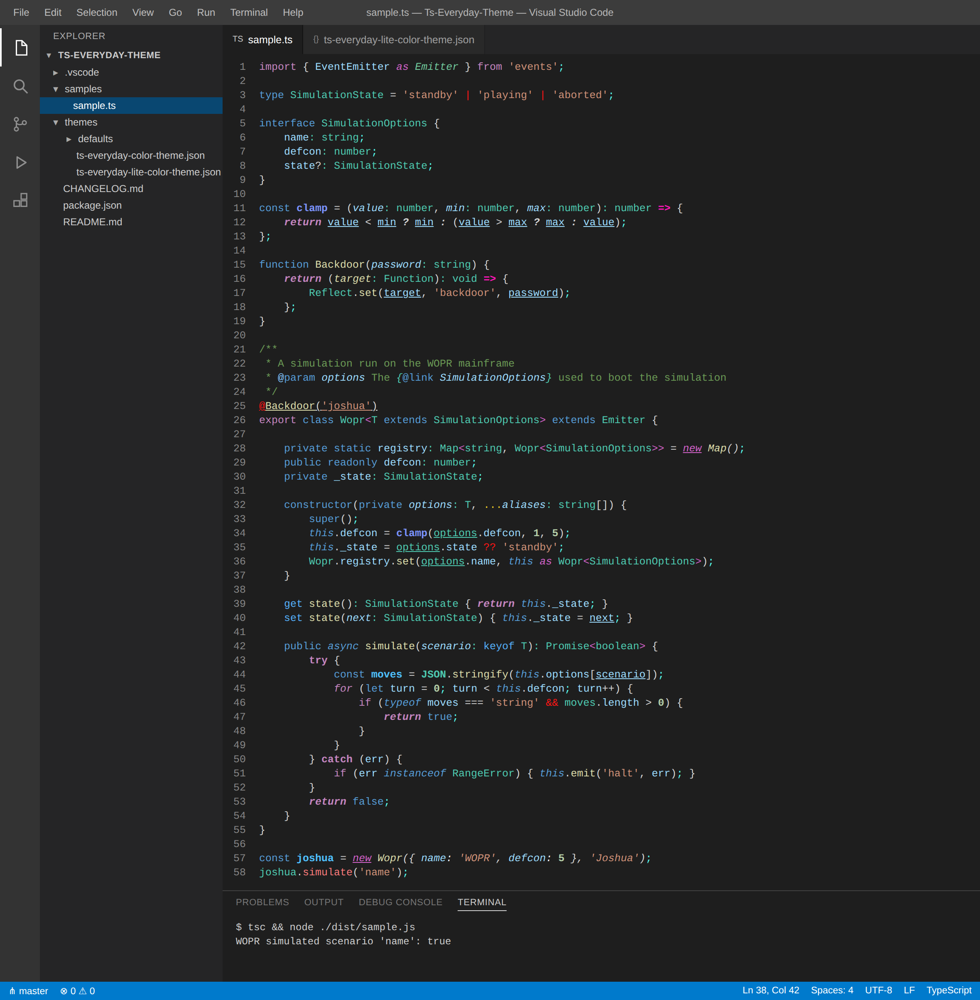

# Ts-Everyday-Theme

[![MIT License][license-image]][license-url]

*A pair of dark themes for VS Code, designed specifically for everyday use with TypeScript*



## Installing

Installing the TS Everyday themes is really simple. Simply launch VS Code Quick Open (`Ctrl+P`) and paste in the following command:

```batchfile
ext install Slither.ts-everyday-theme
```

Or, install it straight from the [Visual Studio Marketplace][marketplace-url]. Then, open the Color Theme picker (`Ctrl+K Ctrl+T`) and choose either **TS Everyday** or **TS Everyday Lite**.

## What does this extension do?

I write TypeScript every day, and over time I kept tweaking the stock **Dark+** theme with small bits of syntax highlighting that made the language's *structure* easier to see at a glance- which operators are type-level vs. runtime, where the control flow changes, which identifiers are parameters, and so on. Eventually those tweaks grew into a proper theme, and, thus, this extension was born.

The extension ships with **2** themes, and both of them share the exact same TypeScript syntax highlighting:

* **TS Everyday** - A dark-purple theme that re-skins the entire VS Code workbench (title bar, activity bar, side bar, tabs, panel, terminal, & status bar) with a near-black editor, to compliment the custom TypeScript highlighting
* **TS Everyday Lite** - A classic Dark+ based theme that leaves the workbench alone, with the same syntax highlighting as TS Everyday

Both themes are built directly on top of VS Code's own `dark_plus.json`, so anything not explicitly overridden looks exactly like the Dark+ you already know. If you are a minimalist, the Lite flavor is for you.

Let's take a look at what the Lite flavor looks like with the same sample file:



As you can see, the *code* is identical between the two- only the workbench around it changes.

## So, what exactly gets highlighted?

The custom highlighting comes in two layers: classic **TextMate rules** (scoped to TypeScript), and **semantic tokens** contributed by the TypeScript language service at runtime. You can follow along with any of the rules below in [`samples/sample.ts`](samples/sample.ts), which is the file rendered in the previews above.

### The TextMate rules

The general idea:

* **Type-level syntax stands apart from runtime code** - generic brackets (`<` / `>`) & `as` are *pink italics*, type operators (`|` / `&`) are red, and type annotations are teal
* **Control flow is hard to miss** - keywords like `return` & `await` are ***bold italics***, `try` / `catch` is bold, `new` is underlined, and the arrow of an arrow function (`=>`) is hot-pink
* **Structural punctuation gets color** - decorators have a bright red `@`, semicolons are cyan, and rest / spread (`...`) is yellow
* **Signal over noise** - JSDoc tags, types, & variables each get their own styling, while plain `//` comments are dimmed way down

### The semantic tokens

Both themes also enable VS Code's [semantic highlighting](https://code.visualstudio.com/api/language-extensions/semantic-highlight-guide), which means the TypeScript **language service** (not just the grammar) classifies identifiers, and the theme styles those classifications:

* **Parameters** are *italicized* at their declaration, and <ins>underlined</ins> everywhere they're used- so inside a long function body you always know which values came in from the outside
* **Async members** are salmon (`#f77a7a`) at their *call sites*, but stay the normal function gold (`#dcdcaa`) at their declaration. In other words: the color tells you, at the call site, that you're looking at something you probably need to `await`
* **Readonly functions** (i.e. `const` arrow functions) are **bold** periwinkle (`#7c94fd`), to distinguish them from regular `function` declarations
* **Default library variables** like `JSON` & `Reflect` are teal (`#4EC9B0`), matching the built-in types they belong to

Let's take a look at lines 42 & 58 of the sample above. As you can see, `analyze` is gold where the `async` method is *declared*, but salmon where it is *called* from- that's the `member.async` / `member.declaration.async` pair doing its job. That one rule alone has saved me from more than a few forgotten `await`s.

## Generating the previews

The screenshots above are rendered straight from the theme JSON files by the harness in [`preview/`](preview/). If a color changes in the themes, rebuild them with:

```batchfile
cd preview
npm install
npm run build
```

---

**Enjoy!** :smile:

[marketplace-url]: https://marketplace.visualstudio.com/items?itemName=Slither.ts-everyday-theme
[license-image]: https://img.shields.io/github/license/xSlither/Ts-Everyday-Theme
[license-url]: LICENSE
